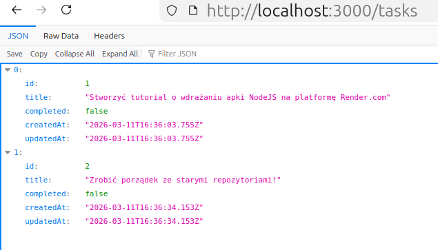
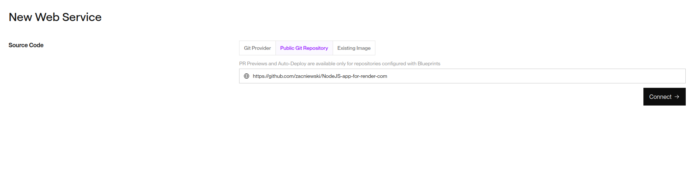
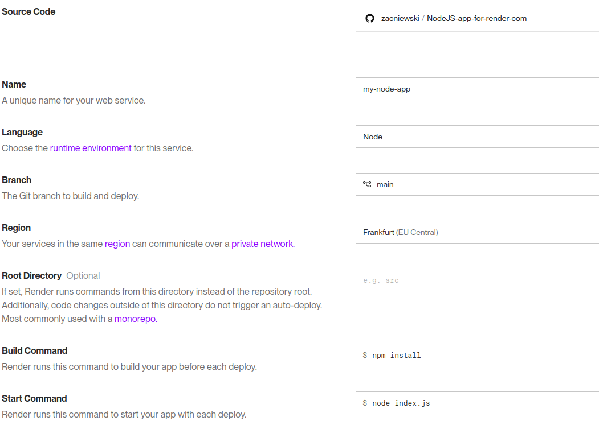
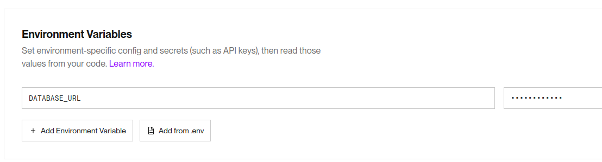
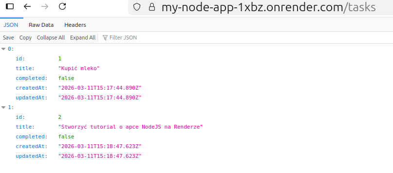
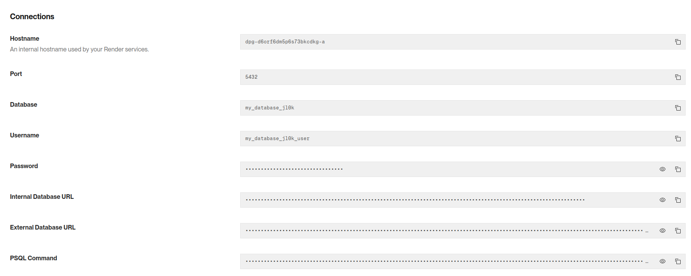
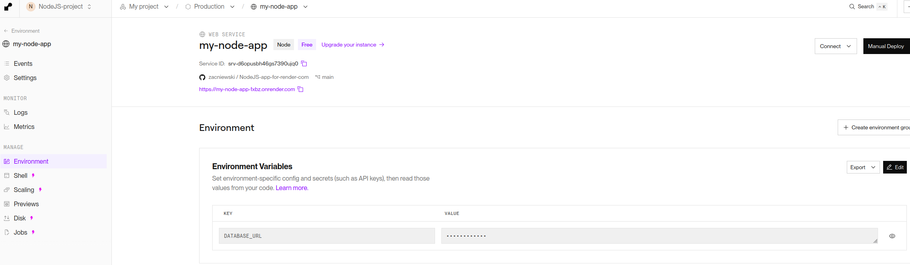
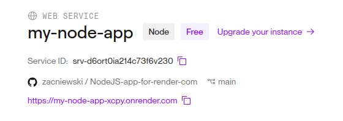

# NodeJS Render.com Demo App

Prosta aplikacja REST API zbudowana w NodeJS (Express.js) z bazą danych SQLite (Sequelize), przygotowana do wdrożenia na platformie Render.com.

## Funkcje
- Listowanie zadań (`GET /tasks`)
- Dodawanie zadań (`POST /tasks`)
- Aktualizacja zadań (`PUT /tasks/:id`)
- Usuwanie zadań (`DELETE /tasks/:id`)

## Przykłady użycia API (cURL)

Poniżej znajdziesz przykłady jak zarządzać zadaniami (zastąp `http://localhost:3000` adresem swojej aplikacji na Renderze, jeśli testujesz w chmurze).

### 1. Dodawanie nowego zadania (Create)
```bash
curl -X POST http://localhost:3000/tasks \
     -H "Content-Type: application/json" \
     -d '{"title": "Kupić mleko"}'
```

### 2. Pobieranie wszystkich zadań (Read)
```bash
curl http://localhost:3000/tasks
```

### 3. Aktualizacja zadania (Update)
Załóżmy, że zadanie ma ID `1`:
```bash
curl -X PUT http://localhost:3000/tasks/1 \
     -H "Content-Type: application/json" \
     -d '{"title": "Kupić mleko i chleb", "completed": true}'
```

### 4. Usuwanie zadania (Delete)
```bash
curl -X DELETE http://localhost:3000/tasks/1
```

## Instalacja lokalna

1. Sklonuj repozytorium:
   ```bash
   git clone <url-twojego-repozytorium>
   cd NodeJS-app-for-render-com
   ```

2. Zainstaluj zależności:
   ```bash
   npm install
   ```

3. Uruchom aplikację:
   ```bash
   npm start
   ```
   Aplikacja będzie dostępna pod adresem: `http://localhost:3000`  
 
---
Przykładowy widok po dodaniu dwóch zadań:  


# Tutorial: Wdrożenie na Render.com (Krok po kroku)

Ten przewodnik pomoże Ci wdrożyć tę aplikację na platformie Render.com.

## Krok 1: Przygotowanie repozytorium GitHub

Upewnij się, że Twój kod znajduje się w publicznym lub prywatnym repozytorium na GitHub (lub GitLab/Bitbucket).

## Krok 2: Rejestracja i logowanie na Render.com

1. Wejdź na stronę [render.com](https://render.com/) i załóż darmowe konto.
2. Po zalogowaniu zostaniesz przeniesiony do panelu sterowania (Dashboard).

## Krok 3: Tworzenie nowej usługi (Web Service)

1. W panelu Render kliknij przycisk **"New +"** i wybierz **"Web Service"**.

2. Połącz swoje konto GitHub i wybierz repozytorium `NodeJS-app-for-render-com`.  


## Krok 4: Konfiguracja usługi

Wypełnij formularz konfiguracji następującymi danymi:

- **Name**: Dowolna nazwa (np. `my-node-app`)
- **Region**: Wybierz najbliższy (np. `Frankfurt (EU Central)`)
- **Branch**: `main`
- **Root Directory**: (pozostaw puste)
- **Runtime**: `Node`
- **Build Command**: `npm install`
- **Start Command**: `npm start`

W sekcji **Instance Type** wybierz darmowy plan (**Free**).  
> Nie wciskaj jeszcze `Deploy Web Service`!



## Krok 5: Konfiguracja bazy danych (SQLite lub PostgreSQL)

Ponieważ Render używa efemerycznego systemu plików (zmiany w plikach znikają po restarcie), w darmowym planie baza SQLite będzie się resetować przy każdym wdrożeniu. Aby zachować dane, na Renderze zazwyczaj używa się dysków (Blueprints/Disks), ale w darmowym planie Web Service możemy po prostu korzystać z bazy w pamięci lub akceptować resetowanie. 

Jeśli chcesz, aby baza była trwała i profesjonalna, zalecane jest użycie PostgreSQL. Render oferuje darmowy plan dla Postgres (na 90 dni).

### Opcja A: SQLite (Dla szybkich testów)
1. Kliknij **Advanced** w konfiguracji Web Service.
2. Dodaj zmienną środowiskową:
   - Key: `DATABASE_URL`
   - Value: `./database.sqlite`

>   

Teraz możesz wcisnąć `Deploy Web Service`. Jeśli deploy się powiedzie, to otrzymamy unikalny adres URL naszej aplikacji. Można podjąć probę dodania rekordów do bazy danych:  
```shell
$ curl -X POST https://my-node-app-1xbz.onrender.com/ \
     -H "Content-Type: application/json" \
     -d '{"title": "Kupić mleko"}'
     
<!DOCTYPE html>
<html lang="en">
<head>
<meta charset="utf-8">
<title>Error</title>
</head>
<body>
<pre>Cannot POST /</pre>
</body>
</html>
```
Z dokumentacji Rendera:  
> Bezpłatne usługi na Renderze mają ulotny system plików (ang. ephemeral filesystem), co oznacza, że wszelkie zapisane dane (w tym baza SQLite) zostaną usunięte przy każdym wdrożeniu (redeploy) lub ponownym uruchomieniu.
 
Ale ponieważ wcześniej do bazy dodane były rekordy lokalnie, to można podjąć próbę odczytu tasków:  
<br>



### Opcja B: PostgreSQL (Zalecane)
> W darmowym planie na render.com możesz mieć aktywną tylko jedną (1) bazę danych PostgreSQL dla całej przestrzeni roboczej. 
Kluczowe ograniczenia darmowej bazy PostgreSQL:  
    - Liczba: Maksymalnie 1 aktywna instancja.  
    - Czas działania: Baza wygasa po 30 dniach od utworzenia.  
    - Pojemność: Limit pamięci to 1 GB SSD.  
    - Działanie po wygaśnięciu: Po 30 dniach baza staje się niedostępna, masz 14 dni na jej upgrade, w przeciwnym razie dane zostaną usunięte.

1. W Dashboard Render kliknij **"New +"** i wybierz **"PostgreSQL"**.
2. Wypełnij nazwę bazy (np. `my-database`) i kliknij **Create Database**.
3. Po utworzeniu bazy, znajdź sekcję **"Internal Database URL"** i skopiuj jej wartość.

> 

4. Wróć do konfiguracji swojego **Web Service**.  
  
5. W sekcji **Advanced** (jeśli nowa usługa) dodaj / w sekcji **Manage -> Environment** zmień (jeśli zmieniasz wcześniej ustawioną zmienną środowiskową `DATABASE_URL):
   - Key: `DATABASE_URL`
   - Value: (wklej skopiowany URL, powinien zaczynać się od `postgres://...`)
Zapisz zmiany, uruchom deploy (przycisk `Manual Deploy`) i poczekaj na zbudowanie aplikacji.  


## Krok 6: Wdrożenie (Deploy)

1. Kliknij **Create Web Service** na dole strony.
2. Render rozpocznie proces budowania i wdrażania Twojej aplikacji. Możesz śledzić postęp w konsoli logów.

```shell
==> It looks like we don't have access to your repo, but we'll try to clone it anyway.
==> Cloning from https://github.com/zacniewski/NodeJS-app-for-render-com
==> Checking out commit 2db8754a2ac9996c18f12493e41bfc8afa6917af in branch main
==> Using Node.js version 22.22.0 (default)
==> Docs on specifying a Node.js version: https://render.com/docs/node-version
==> Running build command 'npm install'...
added 238 packages, and audited 239 packages in 3s
31 packages are looking for funding
  run `npm fund` for details
7 vulnerabilities (2 low, 5 high)
To address all issues (including breaking changes), run:
  npm audit fix --force
Run `npm audit` for details.
==> Uploading build...
==> Uploaded in 3.8s. Compression took 1.7s
==> Build successful 🎉
==> Deploying...
==> Setting WEB_CONCURRENCY=1 by default, based on available CPUs in the instance
==> Running 'node index.js'
Server is running on port 10000
Database synced
==> Your service is live 🎉
==> 
==> ///////////////////////////////////////////////////////////
==> 
==> Available at your primary URL https://my-node-app-xcpy.onrender.com
==> 
==> ///////////////////////////////////////////////////////////
```

3. Gdy status zmieni się na **"Live"**, Twoja aplikacja jest dostępna pod adresem URL widocznym w lewym górnym rogu panelu.

> 

## Krok 7: Testowanie wdrożonej aplikacji

Możesz sprawdzić czy aplikacja działa, wchodząc na jej adres URL w przeglądarce lub używając narzędzia typu Postman/cURL, aby odpytać endpoint `/tasks`.

Gratulacje! Twoja aplikacja NodeJS działa w chmurze!